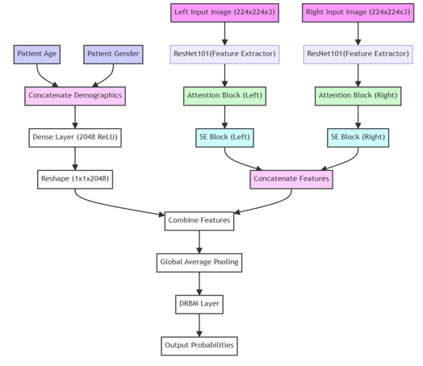

# Multi-Modal-Retinal-Fundus-Scan-Analysis
A multi-modal approach for multiclass ophthalmic disease classification for fundus scan images.
## Overview
The Eye Doctor System is an application designed to assist in diagnosing eye diseases using fundus images. It consists of a Flask-based backend that receives patient information including age, sex, and left/right fundus scans. This data is then processed by a deep learning model to predict the confidence percentage of various eye diseases. The predictions are sent to the front-end for display, where users have the option to view a diagnostic report generated by an AI Large Language Model.

## System Components
### Backend (Flask App)
- Receives patient information and fundus images
- Processes data using a deep learning model
- Generates confidence percentages for eye diseases

### Frontend (HTML/CSS/JavaScript)
- Displays predictions and diagnostic reports
- Provides user interface for interaction with the system


### Deep Learning Model
- Processes input data to predict eye disease probabilities
- Utilizing late fusion technique to combine the patient demographich features with the Fundus scan features.



### AI Large Language Model
- Generates diagnostic reports based on patient information and disease predictions

## Usage
1. Start the Flask backend by running `python app.py`.
2. Open the frontend interface (index.html) in a web browser.
3. Enter patient details and upload left/right fundus scans.
4. View the predicted confidence percentages for various eye diseases.
5. Optionally, request a diagnostic report from the AI Large Language Model.

## Obtaining and Training the Model
1. Obtain the `OIA-ODIR` dataset from [https://drive.google.com/file/d/1-7DO1jJFC_4W0hc2CaonlLe595M4eDOh/view].
2. Follow the instructions provided in the provided Notebook[FUNDUS-DEEP-NET-AUGMENTED.ipynb] file to train the model.

## Obtaining and Training the Model
1. Obtain the `OIA-ODIR` dataset from [https://drive.google.com/file/d/1-7DO1jJFC_4W0hc2CaonlLe595M4eDOh/view].
2. Follow the instructions provided in the provided [Jupyter NoteBook](FUNDUS-DEEP-NET-AUGMENTED.ipynb) file to train the model.

## Installation
1. Clone the repository to your local machine:
   ```bash
   git clone https://github.com/your-username/eye-doctor.git
   ```
2. Install the necessary dependencies:
   ```bash
   pip install -r requirements.txt
   ```
3. Start the Flask backend:
   ```bash
   python app.py
   ```
4. Open the frontend interface (index.html) in a web browser.

## Dependencies
- Flask
- Deep learning framework (e.g., TensorFlow, PyTorch)
- AI Large Language Model library (e.g., OpenAI GPT)

## License
This project is licensed under the MIT License - see the [LICENSE](LICENSE) file for details.
